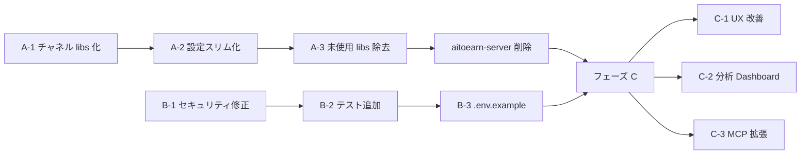

# SNS Factory 改善計画（改訂版）

> **前提**: AiToEarn（14+ プラットフォーム対応のフルスタック AI コンテンツマーケティング基盤）から、**個人用・低コスト・5 媒体**に絞って部分抽出・改良中のプロジェクト。

---

## 現状の抽出完了度マップ

| レイヤー | 状態 | 備考 |
|---|---|---|
| **独自 Factory コード** | ✅ 完了 | auth / flow / content / publishing / snapshot / api-key / MCP |
| **ローカルキュー** | ✅ 完了 | BullMQ worker を [FactoryLocalQueueService](file:///c:/monetization/backend/apps/factory-server/src/factory/publishing/factory-local-queue.service.ts#16-168) (in-memory timer) に差替済 |
| **Web 管理画面** | ✅ 完了 | 5 ページ + モバイル対応ナビ、Google Fonts 依存排除済 |
| **Docker インフラ** | ✅ 完了 | MongoDB + Valkey の最小構成 |
| **チャネルアダプター** | 🔶 未分離 | 29 個の `../../../aitoearn-server/src/...` 相対インポート |
| **`@yikart/*` libs** | 🔶 そのまま流用 | 16 libs 中、実際に使われるのは 8 個程度 |
| **設定スキーマ** | 🔶 肥大 | bilibili, douyin, kwai, wxPlat 等の未使用セクションが残存 |

---

## フェーズ A — 抽出の完了（最優先）

抽出を「完了」状態にして、aitoearn-server への依存をゼロにする。

### A-1. チャネルアダプターの libs 化

現在 [factory.module.ts](file:///c:/monetization/backend/apps/factory-server/src/factory/factory.module.ts) が aitoearn-server から直接インポートしている 29 サービスを、新しい共有 lib に移動。

```
libs/channel-adapters/     ← 新規作成
  src/
    platforms/             ← Meta, Twitter, TikTok, YouTube の OAuth + account 管理
    publishing/            ← 5 プラットフォームの publish provider
    media/                 ← MediaService, MediaGroupService, MediaStagingService
    index.ts
```

> [!IMPORTANT]
> これにより `eslint-disable @nx/enforce-module-boundaries` を削除でき、`aitoearn-server` ディレクトリ自体を将来的に削除可能になる。

### A-2. 設定スキーマのスリム化

[config.ts](file:///c:/monetization/backend/apps/factory-server/src/config.ts) と [config.js](file:///c:/monetization/backend/apps/factory-server/config/config.js) から以下を除去:

- `bilibili`, `douyin`, `kwai`, `wxPlat`, `myWxPlat` — 中国系 SNS（スコープ外）
- `aliSms` — SMS 認証（個人用なので不要）
- `aiClient` — AI クライアント（未接続）
- `mail` — メール送信（未使用）
- `pinterest`, `linkedin`, `googleBusiness` — v1 対象外プラットフォーム

### A-3. 未使用 libs の除去

16 libs のうち factory-server が **使っていない** もの:

| lib | 理由 |
|---|---|
| `ali-oss` | Alibaba Cloud OSS（使用せず） |
| `ali-sms` | SMS 認証（個人用で不要） |
| `aitoearn-ai-client` | AI クライアント（config に残るのみ） |
| `aitoearn-server-client` | relay 通信用（factory では不使用） |
| `mail` | メール送信（未使用） |
| `nest-mcp` | MCP SDK ラッパー（factory-mcp-controller は自前実装） |

---

## フェーズ B — 品質強化

### B-1. セキュリティ修正

| 項目 | 現状 | 修正 |
|---|---|---|
| **CORS** | `enableCors()` オプション無し | `origin` を明示的に指定 |
| **パスワード salt** | 3 bytes | 16 bytes に変更 |
| **PBKDF2 iterations** | 10,000 | 100,000+ に変更 |
| **PBKDF2 algorithm** | sha1 | sha256 に変更 |
| **JWT secret** | `'factory-dev-secret'` がフォールバック | 環境変数必須化 or 起動時警告 |
| **Admin 上書き** | 毎起動でパスワードリセット | 初回 seed のみ設定、既存は name/status のみ同期 |

### B-2. テスト追加

ゼロからのスタートなので、**ROI の高い箇所** に絞る:

1. [password.util.ts](file:///c:/monetization/backend/apps/factory-server/src/factory/utils/password.util.ts) — encrypt / validate の unit test
2. `FactoryPublishingService.updateFlowStatus` — ステータス遷移ロジック
3. [FactoryLocalQueueService](file:///c:/monetization/backend/apps/factory-server/src/factory/publishing/factory-local-queue.service.ts#16-168) — retry / backoff / failure ハンドリング
4. [factoryFetch](file:///c:/monetization/web/lib/factory-api.ts#20-46) (web) — envelope 解釈、エラーハンドリング

### B-3. `.env.example` の作成

必須 / オプション環境変数を一覧化したテンプレートを作成。README の「Required envs」セクションと整合。

---

## フェーズ C — 次のステージ

抽出が完了し品質が安定した後の拡張。

### C-1. Web UX の底上げ

| 改善 | 効果 |
|---|---|
| **ローディング状態** | API 呼び出し中のスケルトン/スピナー表示 |
| **アセット編集・削除** | Library ページに CRUD 完備 |
| **Queue 自動更新** | 30 秒ポーリングで状態をリフレッシュ |
| **ダークモード** | CSS 変数を活用して `prefers-color-scheme` 対応 |
| **`fieldStyle` の共通化** | 3 ファイルで重複定義 → [factory-shell.tsx](file:///c:/monetization/web/components/factory-shell.tsx) に一本化 |

### C-2. 分析ダッシュボード

[FactorySnapshotService](file:///c:/monetization/backend/apps/factory-server/src/factory/factory-snapshot.service.ts#5-19) が既にアカウント / 投稿スナップショットを保存しているが、**閲覧する UI がない**。[toJobResponse](file:///c:/monetization/backend/apps/factory-server/src/factory/publishing/factory-publishing.service.ts#382-405) の `metrics` も全て `null`。

- スナップショットデータを集計して Dashboard ページを追加
- 投稿ごとの views / likes / comments を時系列表示

### C-3. MCP / AI 連携の強化

[factory-mcp.controller.ts](file:///c:/monetization/backend/apps/factory-server/src/factory/factory-mcp.controller.ts) が既にあるが、5 エンドポイントのみ。

拡張候補:
- `create_content_asset` — AI が素材を直接作成
- `list_flows` / `get_flow_status` — フロー一覧・状態取得
- `list_jobs` — ジョブ一覧取得
- `schedule_flow` — 予約投稿をスケジュール

### C-4. Docker Compose の強化

```diff
 services:
   mongo:
     image: mongo:8
+    healthcheck:
+      test: ["CMD", "mongosh", "--eval", "db.adminCommand('ping')"]
+      interval: 10s
+      timeout: 5s
+      retries: 5
   valkey:
     image: valkey/valkey:8-alpine
+    healthcheck:
+      test: ["CMD", "valkey-cli", "ping"]
+      interval: 10s
+      timeout: 5s
+      retries: 5
```

---

## 推奨実施順序



> **A と B は並行作業可能**。A-1 が最もインパクトが大きく、完了すれば aitoearn-server を削除してリポジトリを大幅に軽量化できます。

## 検証方針

- **A: 抽出完了**: `nx lint factory-server` + `pnpm run build:factory` 通過、[smoke.ps1](file:///c:/monetization/scripts/smoke.ps1) 全項目パス
- **B: 品質**: `vitest` で新規テスト実行
- **C: UX**: ブラウザで各ページの動作を目視確認 + スクリーンショット
